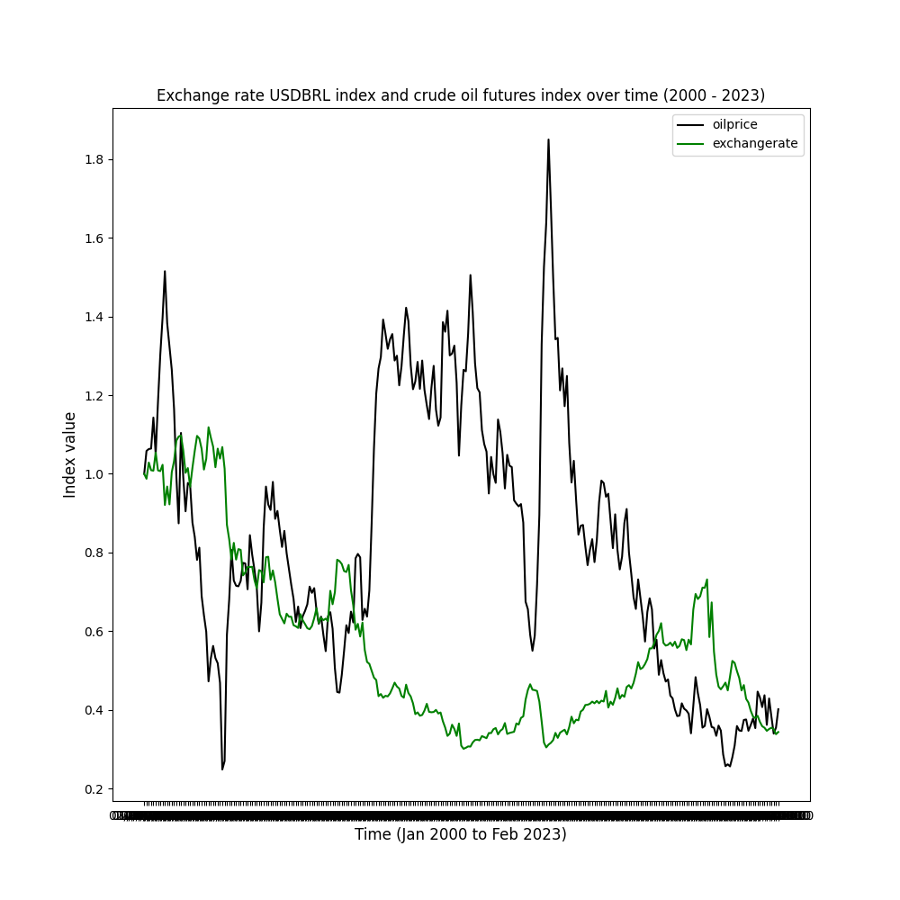
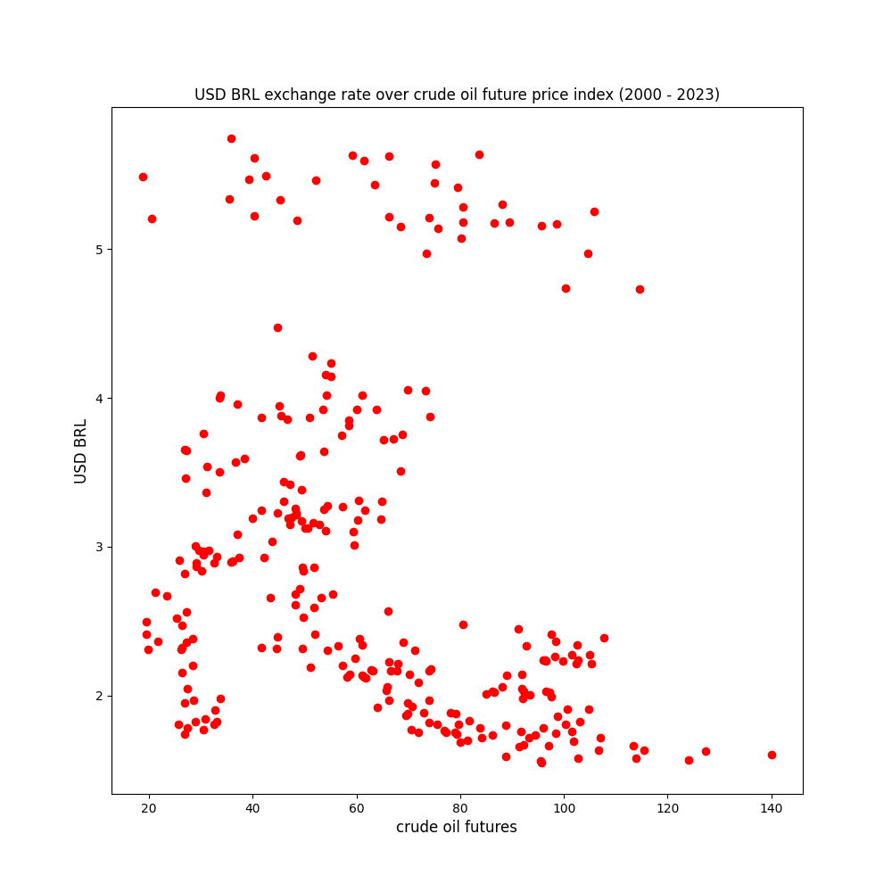
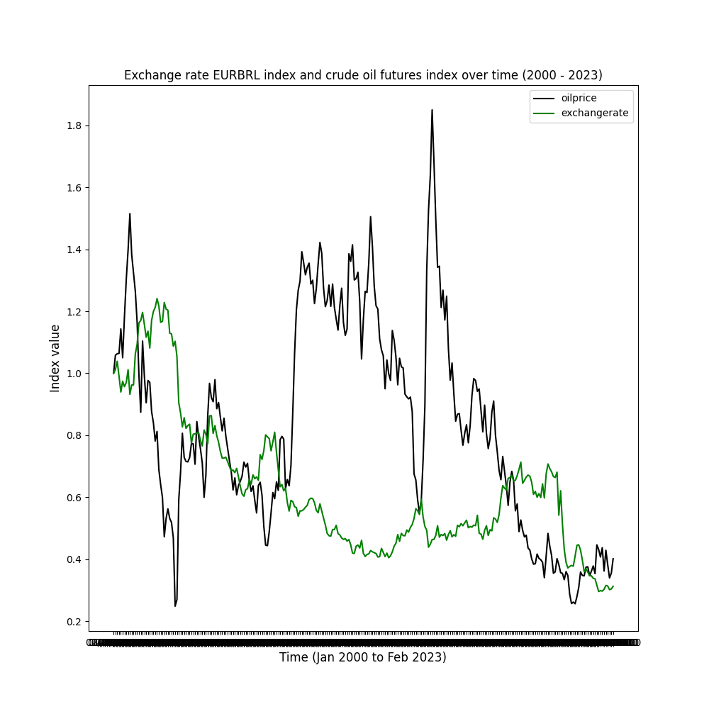

# usdbrl
my repo for predicting usd brl exchange rate

you can e.g. make similar analysis with quandl data, querying quandl data in Python. I covered this on my blog, see here https://www.supplychaindataanalytics.com/querying-automotive-industry-data-from-quandl-in-python/

## first thing that I looked at was crude oil futures vs exchange rate

here is how crude oil futures and the usd brl exchange rate have developed throughout time since January 2000

looking at a scatterplot of crude oil futures vs usd brl exchange rate:

for reference, this is how eur brl exchange rate have developed in comparison to crude oil prices

